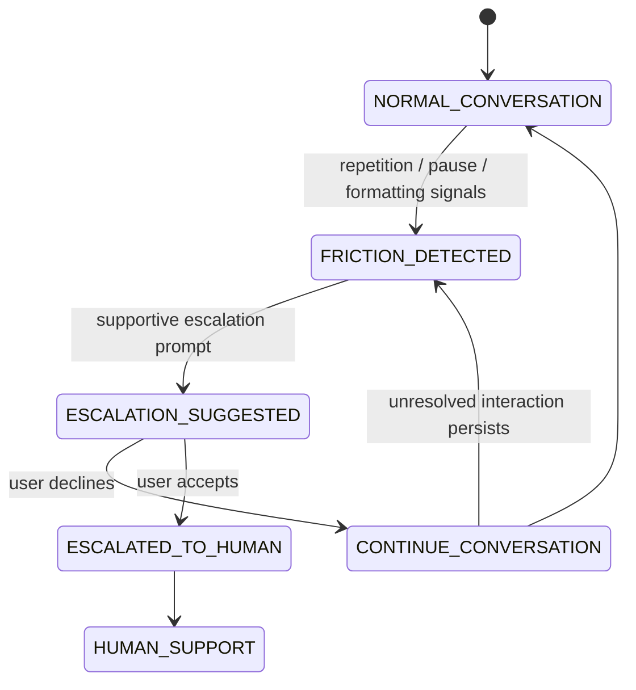

# Friction-Aware Customer Support Assistant (MVP)

## Overview

This project is an MVP (Minimum Viable Product) for a customer support assistant designed to reduce conversational friction, detect possible frustration signals, and support smoother transitions between automated support and human agents.

Instead of continuously relying on an LLM throughout the entire conversation, the system uses a hybrid approach:

* lightweight rule-based heuristics during live interaction
* selective AI summarization only during escalation

The project explores how conversational systems can balance:

* user experience
* cost-efficient AI usage
* privacy-conscious design
* and human-in-the-loop support workflows

---

## Core Idea

Many customer support systems rely either on:

* fully automated chatbots, or
* immediate escalation to human agents

This project explores a middle-ground approach:

1. lightweight behavioral signals monitor conversational friction during interaction
2. escalation remains optional and user-controlled
3. AI summarization is only triggered during human handoff

The goal is not to replace human support, but to reduce friction during support interactions and improve the transition between automated and human assistance.

---

## Features & System Design

### 1. Rule-Based Friction Detection

To reduce unnecessary API usage and keep the system lightweight, the project does not use an LLM for continuous real-time sentiment analysis.

Instead, it tracks simple interaction signals such as:

* repeated or closely reworded questions
* aggressive formatting (`ALL CAPS`, repeated punctuation like `!!!`)
* unusually long pauses after unresolved responses

These signals are treated as behavioral heuristics rather than definitive emotional interpretation.

---

### 2. User-Controlled Escalation

When potential friction signals are detected:

* the system may suggest escalation to a human support agent
* users can choose to escalate or continue chatting normally
* escalation is never forced automatically

The system is designed to keep users in control of the interaction flow.

---

### 3. Privacy-Conscious AI Usage

User conversations are not continuously processed by external AI systems.

* live chats remain within the application backend
* AI summarization is only triggered after explicit user escalation
* users are aware when conversation data is being prepared for human review

This approach attempts to reduce unnecessary external processing of user conversations while keeping AI usage transparent.

---

### 4. AI-Assisted Human Handoff

When escalation occurs:

1. the full conversation history is preserved
2. an LLM generates a concise support summary
3. both the summary and raw chat logs are provided to the human support agent

The summary is intended to:

* reduce context recovery time for support agents
* minimize repeated questioning
* help conversations continue more smoothly after escalation

Raw chat logs remain available to allow human agents to verify details or review additional context when needed.

---

### 5. Inclusive Communication Design

The project also explores how support system wording may affect user experience, especially for:

* elderly users
* low digital literacy users
* users experiencing frustration or cognitive overload

System prompts are intentionally written in a supportive and non-blaming tone, focusing on system limitations rather than implying user failure.

#### Example Prompt Design

| Situation                    | Example Prompt                                                                                                                   |
| ---------------------------- | -------------------------------------------------------------------------------------------------------------------------------- |
| Repeated questions           | “I'm sorry my answers haven't been as helpful as they should be. Would you like me to connect you with a team member?”         |
| Confusion / unresolved issue | “This looks like a situation that needs a human touch to get exactly right. I can help connect you with one of our team members if you'd like.” |
| Escalation suggestion        | “If you feel this issue would be easier with a human team member, I can help transfer the conversation.”                         |

---

## Architectural Considerations

### Awareness of Silent Disengagement

Traditional metrics such as low escalation rates do not always indicate successful support interactions.

Users may stop responding due to:

* confusion
* fatigue
* frustration
* or disengagement

Because of this, the system treats prolonged pauses and repeated unresolved questions as possible interaction signals rather than assuming silence means successful resolution.

---

### Human-in-the-Loop Design

AI is used as a support tool rather than a final decision-maker.

* rule-based logic handles lightweight interaction monitoring
* AI is used for summarization during escalation
* human agents remain responsible for final interpretation and resolution

This project intentionally keeps humans involved in ambiguous or high-context situations.

---

### Cost-Efficient AI Usage

Rather than sending every message through an LLM pipeline, the system limits AI usage to escalation events where summarization provides clear value.

This approach helps reduce:

* unnecessary API usage
* latency overhead
* continuous external processing of user conversations

while still benefiting from AI-assisted context compression during handoff.

---

## State Flow Overview

The system models conversational interaction as a small state-driven workflow:

---

## Tech Stack

* Python
* Streamlit
* SQL Database
* LLM API (used only during escalation summarization)

Core implementation includes:

* rule-based conditional logic
* conversation state tracking
* escalation workflow management
* AI-assisted summarization during handoff

---

## Limitations

* rule-based heuristics may produce false positives or false negatives
* pause-based detection is approximate and context-dependent
* AI summarization may omit subtle conversational nuance
* the system currently uses simple heuristics rather than adaptive behavioral modeling

---

## Future Improvements

* optional hybrid sentiment analysis layer
* adaptive escalation thresholds
* usability testing with different user groups
* multilingual support
* analytics for escalation outcomes and interaction flow patterns
* improved personalization of support prompts

---

## Project Status

Current project stage:

* MVP / exploratory prototype

Implemented:

* rule-based friction detection
* optional escalation workflow
* AI-generated handoff summaries
* SQL-backed conversation storage
* Streamlit-based support interface

This project primarily explores:

* human-centered conversational workflows
* lightweight behavioral signal detection
* human-in-the-loop support systems
* selective and cost-aware AI integration
